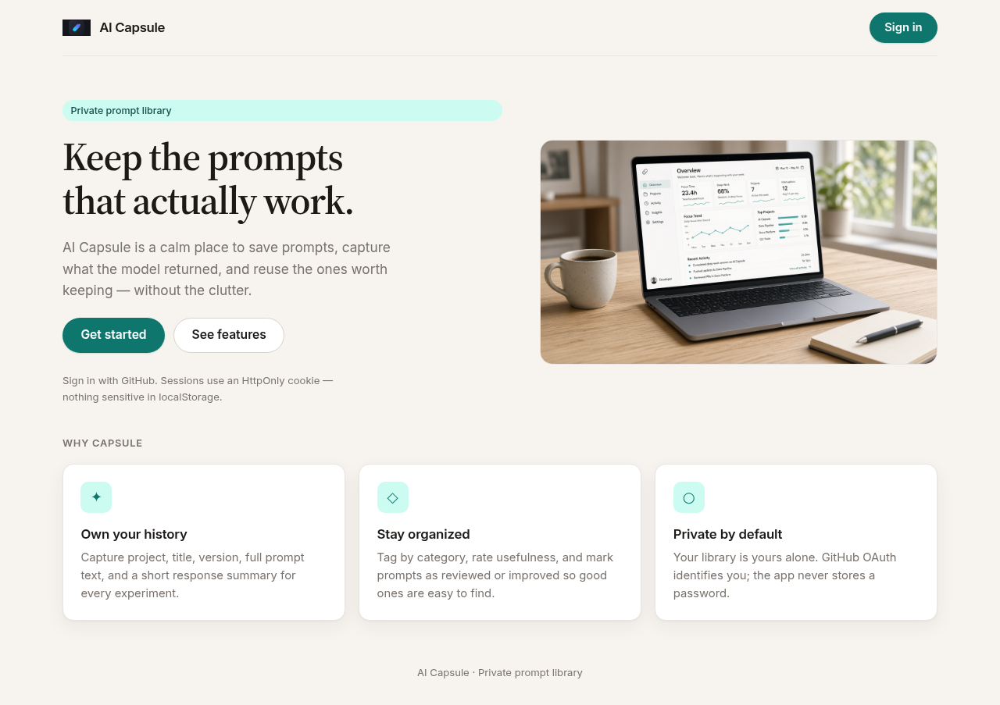
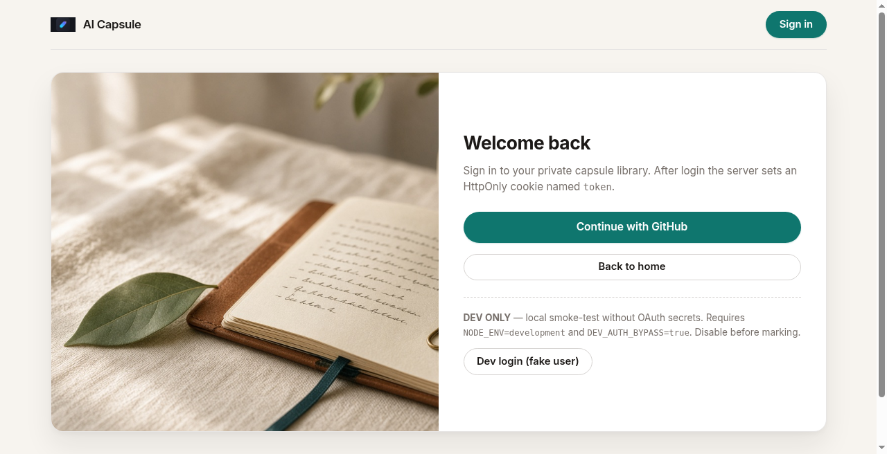
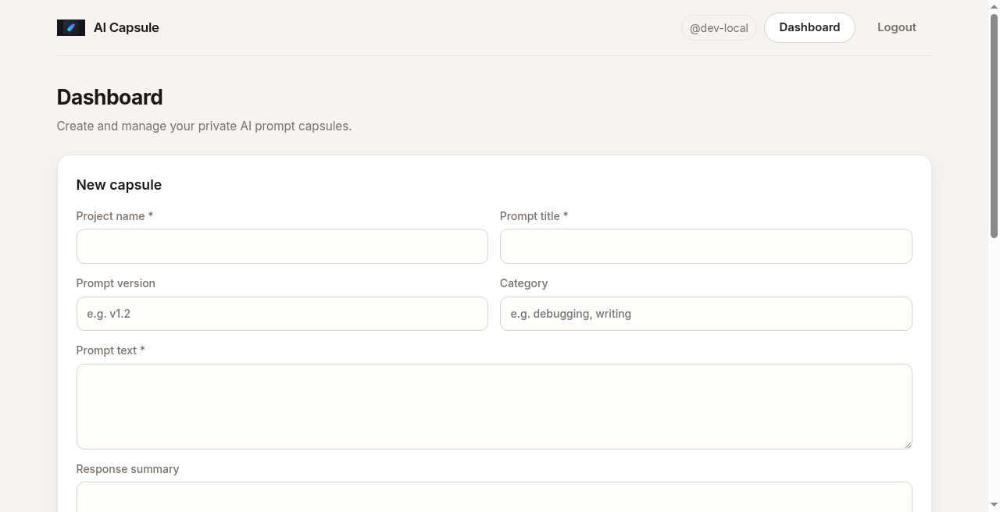
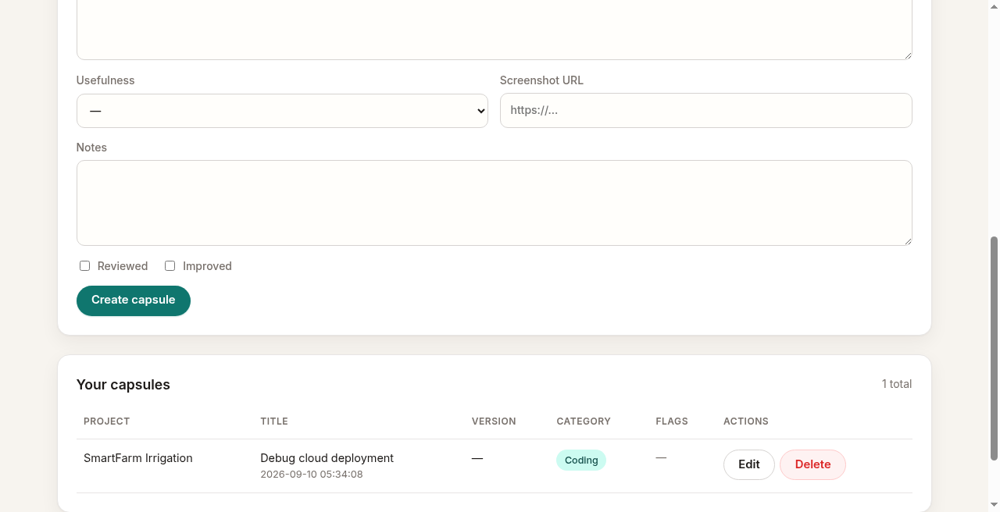

# AI Capsule

Private AI prompt library for CSE3CWA / CSE5006 Assignment 3.

Save prompts, versions, response summaries, and review notes in a personal archive authenticated with **GitHub OAuth**. The Express server mints its **own JWT** (jsonwebtoken) and stores it in an **HttpOnly cookie** named `token` — never localStorage or Bearer tokens for the app session.


## Screenshots

| Landing | Login |
|--------|--------|
|  |  |

| Dashboard form | Capsule list |
|----------------|--------------|
|  |  |

## Features

- Public landing page (`/`) and login (`/login`)
- Protected dashboard (`/dashboard`) with full CRUD for capsules
- GitHub OAuth to application JWT cookie
- SQLite database (auto-created on server start)
- Monorepo: React (Vite) client + Express server; production serves the built client from Express (same-origin cookies)

## Tech stack

| Layer | Technology |
|-------|------------|
| Frontend | React 18, React Router, Vite |
| Backend | Node.js, Express |
| Auth | GitHub OAuth, JWT (jsonwebtoken), HttpOnly cookie `token` |
| Database | SQLite via better-sqlite3 |

## Project structure

```
ai-capsule/
├── client/                 # Vite + React SPA
│   └── src/
├── server/                 # Express API + static serve in production
│   └── src/
├── package.json            # root scripts: dev, build, start
├── .env.example
└── README.md
```

## Install & run (local)

**Requirements:** Node.js 18+ and npm.

```bash
# from repo root
cp .env.example .env
# edit .env — at minimum set JWT_SECRET; for OAuth set GitHub app credentials

npm install --prefix server
npm install --prefix client
npm install   # root (concurrently for `npm run dev`)

# development (API :5000, Vite :5173 with proxy)
npm run dev

# production-style
npm run build
NODE_ENV=production npm start
```

- Dev client: `http://localhost:5173` (proxies `/api` and `/auth` to the server)
- API / production: `http://localhost:5000`

### Cookie Secure flag

In **production** (`NODE_ENV=production`) the `token` cookie is set with `Secure: true` (HTTPS only).
In **local development** `Secure` is `false` so the cookie works over `http://localhost`.

## Environment variables

Copy `.env.example` to `.env`. **Never commit secrets.**

| Name | Purpose |
|------|---------|
| `PORT` | Server port (default `5000`) |
| `NODE_ENV` | `development` or `production` |
| `JWT_SECRET` | Secret used to sign/verify the app JWT |
| `GITHUB_CLIENT_ID` | GitHub OAuth App client ID |
| `GITHUB_CLIENT_SECRET` | GitHub OAuth App client secret |
| `GITHUB_CALLBACK_URL` | e.g. `http://localhost:5000/auth/github/callback` |
| `CLIENT_URL` | Frontend origin in dev (e.g. `http://localhost:5173`) |
| `APP_URL` | Public app/API base URL |
| `DEV_AUTH_BYPASS` | `true` enables **dev-only** fake login when `NODE_ENV=development` |

### GitHub OAuth App setup

1. GitHub → Settings → Developer settings → OAuth Apps → New
2. Homepage URL: your app URL (local or deployed)
3. Authorization callback URL: must match `GITHUB_CALLBACK_URL`
4. Copy Client ID / Secret into `.env`

### DEV auth bypass (local smoke-test only)

When `NODE_ENV=development` **and** `DEV_AUTH_BYPASS=true`:

- `GET` or `POST` `/auth/dev-login` issues a real app JWT for user `dev-user-1` / `dev-local`
- The Login page shows a clearly labeled **Dev login** button

**Disable / remove before marking or production.** Markers should use real GitHub OAuth on the deployed app.

## Auth flow (OAuth + JWT cookie)

1. User opens `/login` and clicks **Continue with GitHub** → `GET /auth/github`
2. GitHub redirects to `/auth/github/callback?code=...`
3. Server exchanges `code` for a GitHub access token, loads the GitHub user
4. Server signs its **own** JWT with `JWT_SECRET` (`userId`, `login`)
5. Server sets HttpOnly cookie `token` and redirects to `/dashboard`
6. Browser sends the cookie on same-origin (or proxied) fetch with `credentials: 'include'`
7. `requireAuth` middleware verifies the JWT; CRUD uses `req.user.id` only — **never** `user_id` from the request body
8. Logout: `POST /auth/logout` clears the cookie

## API routes

| Method | Path | Auth | Notes |
|--------|------|------|-------|
| `GET` | `/api/health` | Public | `{ "status": "ok" }` |
| `GET` | `/api/capsules` | JWT cookie | List current user's capsules |
| `POST` | `/api/capsules` | JWT cookie | Create capsule |
| `PUT` | `/api/capsules/:id` | JWT cookie | Update own capsule |
| `DELETE` | `/api/capsules/:id` | JWT cookie | Delete own capsule |
| `GET` | `/auth/github` | Public | Start OAuth |
| `GET` | `/auth/github/callback` | Public | OAuth callback |
| `GET` | `/auth/me` | JWT cookie | Current user |
| `POST` | `/auth/logout` | Public | Clear cookie |
| `GET`/`POST` | `/auth/dev-login` | Dev only | Fake user JWT |

Missing or invalid JWT → **401**.

## SQLite

Schema (created automatically on server start):

```sql
CREATE TABLE capsules (
  id INTEGER PRIMARY KEY AUTOINCREMENT,
  user_id TEXT NOT NULL,
  project_name TEXT NOT NULL,
  prompt_title TEXT NOT NULL,
  prompt_version TEXT,
  prompt_text TEXT NOT NULL,
  response_summary TEXT,
  category TEXT,
  usefulness TEXT,
  reviewed INTEGER DEFAULT 0,
  improved INTEGER DEFAULT 0,
  screenshot_url TEXT,
  notes TEXT,
  created_at TEXT DEFAULT CURRENT_TIMESTAMP
);
```

DB file defaults to `server/data/capsules.db` (gitignored).

### Render / ephemeral disk note

On platforms like **Render** free tier, the filesystem is often **ephemeral**: SQLite data can be wiped on redeploy/restart. For a durable production DB, migrate to a managed Postgres (or similar). For this assignment, SQLite is acceptable if documented.

## React and Express

- **Development:** Vite proxies `/api` and `/auth` to `http://localhost:5000`; CORS allows `CLIENT_URL` with credentials.
- **Production:** `npm run build` outputs `client/dist`; Express serves it statically so the app is **same-origin** and cookies work without CORS.

All client fetch calls use `credentials: 'include'`.

## cURL tests

Health (public):

```bash
curl -s http://localhost:5000/api/health
# {"status":"ok"}
```

Protected route without / with fake cookie (expect **401**):

```bash
curl -s -o /dev/null -w "%{http_code}\n" http://localhost:5000/api/capsules
# 401

curl -s -o /dev/null -w "%{http_code}\n" -H "Cookie: token=fake-token-123" http://localhost:5000/api/capsules
# 401
```

With dev bypass (local only):

```bash
curl -s -c - -X POST http://localhost:5000/auth/dev-login
# then reuse the Set-Cookie token for CRUD requests
```

## Deployed URL / platform

- **Platform:** _[e.g. Render / Railway / Fly.io]_
- **Live URL:** _[https://your-app.onrender.com]_
- **GitHub repo:** https://github.com/ronithrashmikara/ai-capsule

## AI-assisted development

- Tools used: _[e.g. Cursor / ChatGPT]_
- What AI helped with: scaffolding Express/React structure, JWT cookie auth pattern, README draft
- What I changed / verified: _[env setup, OAuth app, manual CRUD testing, deployment]_

## Honest limitation

SQLite on ephemeral hosting means capsule data may not survive redeploys; also GitHub OAuth must be configured with the correct callback URL per environment, which is easy to misconfigure during first deploy.

## License

Educational / assignment use.
